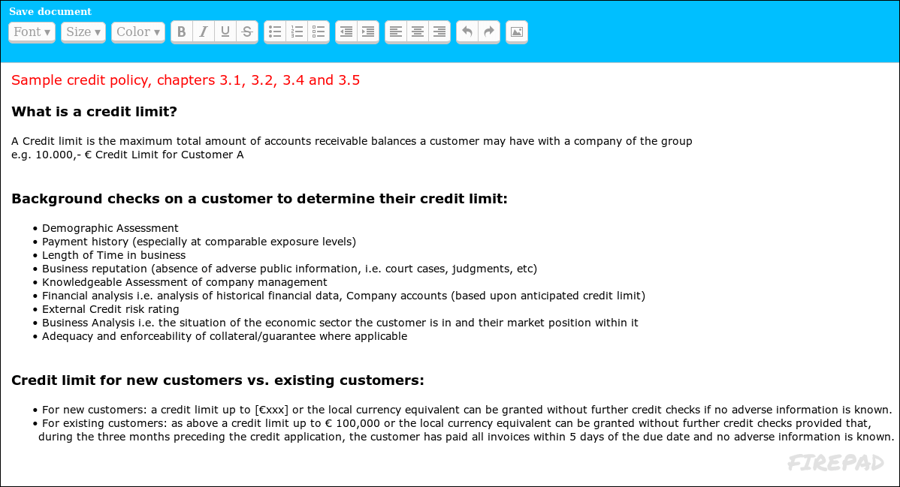

Firepad Editor
==============

Short Description
-----------------

This is a tiny hacked version of a simple collaborative editor. No thrills and
definitely no super cow powers. Just an embarrassingly stupid HTML page with
very littly JavaScript, barely enough to work together on small text exercises.

Copyright
---------

The whole source code is licensed as
[_CC0 1.0 Universell (CC0 1.0)_](https://creativecommons.org/publicdomain/zero/1.0/deed.de)

© 2016 Dennis Schulmeister-Zimolong

E-Mail: [dhbw@windows3.de](mailto:dhbw@windows3.de)  
Website: https://www.wpvs.de/repo/firepad/open/
